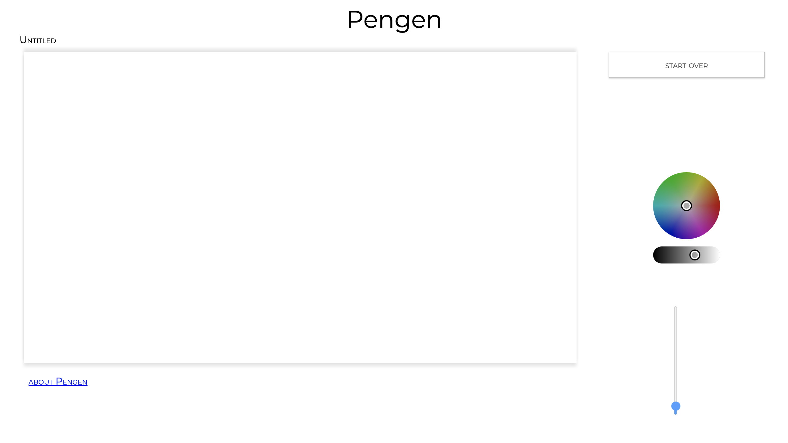

# pengen
A Drawing App created for the Mintbean.io hackathon on November 16, 2021

by collectivenectar & moogwol

Pengen was developed for web browsers to be a drawing app with
a simple set of features:

- A color picker
- A brush size slider
- A 'start over' button to wipe the canvas
- Save/load function (public, no userauth)

To try the app yourself, go to:

https://collectivenectar.github.io/pengen/

To host your own version of this app, follow the instructions in the readme at:

https://github.com/moogwol/pengen-django-api

This app was designed using the fabric.js and iro.js frameworks, so if you want to
develop the app further there are no extra steps.
